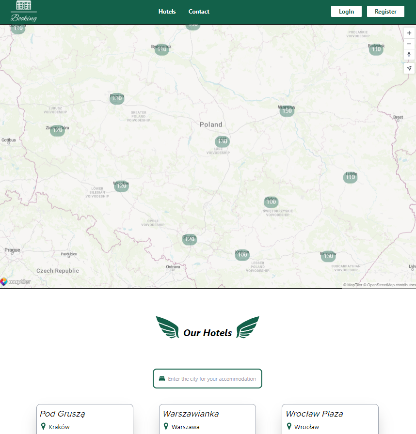

# Booking

Booking is an advanced hotel booking platform designed to give users easy access to a wide range of accommodation options. Our app combines an intuitive user interface with robust backend features to simplify the process of searching, browsing and booking hotels.

## Demo

Demo is not available, to run the project please follow the installation instructions below

## Funkcje

- **Registration and Login**: Users can register and log in to access additional features
- **Browse hotels**: All users can browse available hotels
- **Hotel Reservations**: Logged in users can make hotel reservations
- **Password Encryption**: Keep user data safe with password encryption
- **Map with hotel prices**: The map displays the lowest hotel prices in a given city
- **User panel**: After logging in, users have access to the panel where they can view their booked hotels and hotels added to their favorites.

## Technologies

The project has been implemented using the following technologies:

- React (Redux Toolkit)
- TypeScript
- Tailwind CSS
- Node.js
- Express
- MongoDB (Atlas)

## Installation

To install and run this project, follow these steps:

1. Clone the repository: git clone https://github.com/TomaszGrobelski/Booking.git
2. Navigate to the project directory: cd Booking
3. Install dependencies: npm install
4. In the first terminal, go to the project directory: cd server
5. Run the server: node server.js
6. In the secound terminal in Booking directory, run the application: npm run dev
7. Enjoy and have fun booking Polish hotels :)

## Author

- Tomasz Grobelski - [GitHub](<[link_do_profilu](https://github.com/TomaszGrobelski)>)
